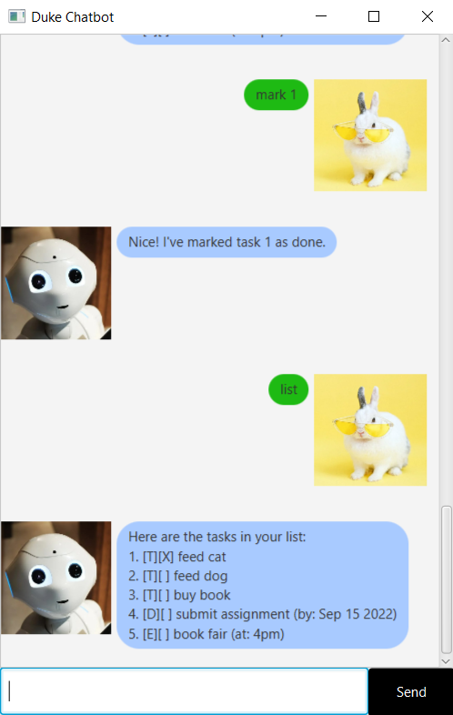

# User Guide
Duke is a Command Line Interface (CLI) based chatbot with a simplistic GUI 
which helps you keep track of different tasks, such as things to do, 
events and deadlines.



- [Getting Started](#getting-started-)
- [List of Commands](#list-of-commands-)
    - [Add a todo task: `todo`](#add-a-todo--todo-task_description-)
    - [Add a deadline task: `deadline`](#add-a-deadline--deadline-task_description-by-datetime-)
    - [Add an event task: `event`](#add-an-event-event-task_description-at-event_time-)
    - [List all tasks: `list`](#list-all-tasks-list-)
    - [Mark a task as done: `mark`](#mark-a-task-as-done-mark-task_number-)
    - [Unmark a task: `unmark`](#unmark-a-task-unmark-task_number-)
    - [Delete a task: `delete`](#delete-a-task-delete-task_number-)
    - [Find tasks matching query: `find`](#find-tasks-matching-query-find-query-)
    - [Exit the program: `bye`](#exit-the-program-bye-)
- [Acknowledgements](#acknowledgements-)

# Getting Started
- Ensure you have Java 11 or above installed.
- Download the latest jar from [here](https://github.com/ConradLew/ip/releases/).
- Copy the file to a home folder for the chatbot.
- Double-click the file to start the app. A GUI similar to the one above should 
appear shortly.
- Type your desired commands (See [List of Commands](#commands)) into the textbox.

# List of Commands

## Add a todo : `todo TASK_DESCRIPTION`
Adds a task to the list with the specified `TASK_DESCRIPTION`.

**Example:**
```
todo feed cat
Task added. You now have 1 tasks in the list.
```

## Add a deadline : `deadline TASK_DESCRIPTION /by DATETIME`
Adds a task with the specified `TASK_DESCRIPTION` and deadline `DATETIME`.
Note that the format of `DATETIME` is as follows: `yyyy-mm-dd`.

**Example:**
```
deadline submit assignment /by 2022-09-15
Task added. You now have 2 tasks in the list.
```

## Add an event: `event TASK_DESCRIPTION /at EVENT_TIME`
Adds an event with the specified `TASK_DESCRIPTION` occurring at `EVENT_TIME`.
Note that the `EVENT_TIME` does not have to follow the `yyyy-mm-dd` format and
can be freely specified.

**Example**:
```
event book fair /at 4pm
Task added. You now have 3 tasks in the list.
```

## List all tasks: `list`
Display all the tasks currently in the task list.

**Example:**
```
list
Here are the tasks in your list:
1. [T][] feed cat
2. [D][] submit assignment (by: Sep 15 2022)
3. [E][] book fair (at: 4pm)
```

## Mark a task as done: `mark TASK_NUMBER`
Marks the task with the given `TASK_NUMBER` as specified by `list` as done.

**Example:**
```
mark 1
Nice! I've marked task 1 as done.

list
1. [T][X] feed cat
2. [D][] submit assignment (by: Sep 15 2022)
3. [E][] book fair (at: 4pm)
```

## Unmark a task: `unmark TASK_NUMBER`
Marks the task with the given `TASK_NUMBER` as specified by `list` as not done.

**Example:**
```
list
1. [T][X] feed cat
2. [D][] submit assignment (by: Sep 15 2022)
3. [E][] book fair (at: 4pm)

unmark 1
OK, I've marked task 1 as not done yet.

list
1. [T][] feed cat
2. [D][] submit assignment (by: Sep 15 2022)
3. [E][] book fair (at: 4pm)
```

## Delete a task: `delete TASK_NUMBER`
Deletes the task with the given `TASK_NUMBER`

**Example:**
```
delete 2
Noted. I've removed task 2.
Now you have 2 tasks in the list.

list
1. [T][] feed cat
2. [E][] book fair (at: 4pm)
```

## Find tasks matching query: `find QUERY`
Displays all tasks with descriptions that match (case-sensitive) the given `QUERY`.

**Example of usage:**
```
find cat
Here are the matching tasks in your list:
1. [T][] feed cat
```

## Exit the program: `bye`
Closes the chatbot.

# Acknowledgements
Documentation format adapted from [AB3 User Guide](https://se-education.org/addressbook-level3/UserGuide.html)